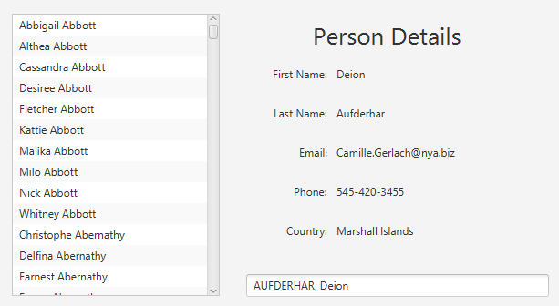

# AutoComplete TextField for Java FX

The AutoComplete TextField control allows end users to select an item from an arbitrarily large list. This is achieved by partially typing the desired selection into a text field, whilst the control dynamically filters the results based on the user input. The user is able to navigate up and down through the filtered suggestions, and select the desired object with the 'TAB' key.


Whilst Java FX has robust support for selecting items from a list, whether it be a `ListView` or employing a set of `CheckBox` or `RadioButton` objects, it becomes cumbersome to cleanly navigate the options as the list grows infinitely large. That's where the AutoComplete TextField comes in, as it can account for really large lists whilst keeping the interface clean.

## Demo

Before diving into the rest of the documentation, you might want to check out a small functional demonstration of the control. In this example, 5000 `Person` objects are created and stored in a list for the user to choose from. You can scroll through the complete list on the left of the application.




To try out the auto-complete function, begin typing in the `TextField` below and watch as the control automatically populates a list of suggestions for you. If you hit 'TAB' the `Person` object will be selected, and you'll be able to see the app dynamically update the complete information about that particular person. Note that you can continue to select other person objects at will and the app will continue to update the display.

To install the demo, please click on the [releases](https://github.com/redbrickhut/FXTextFieldAC/releases) page and download the appropriate version for your platform under the "Assets" heading. Or, if you want the 'bleeding-edge' version you can clone the repository to your machine ([see below](#how-to-install)) and then run the following command from root of the project directory:

**Windows Command Prompt**
```
gradlew.bat run
```

**Linux/Mac**
```
./gradlew run
```
## How to Install

## Instructions

> I highly recommend anyone using this control have a solid understanding of the Property binding system in Java FX. [This article by Oracle](https://docs.oracle.com/javafx/2/binding/jfxpub-binding.htm#:~:text=JavaFX%20properties%20are%20often%20used,in%20a%20variety%20of%20applications.) will provide a solid background if you're relatively new to the Java FX platform.

> There are complete Javadocs planned for this control in a future version.

### First Steps

The AutoComplete TextField extends from a regular TextField, meaning you can interact with it like any normal Java FX control. In order to use the control, you first need to import it with the following line:
```java
import com.redbrickhut.actf.AutoCompleteTextField;
```

### Quickstart: A Simple Example

In order to instantiate an ACTF, it requires as a minimum a list of objects for the user to select from. It takes an [`ObservableList`](https://openjfx.io/javadoc/14/javafx.base/javafx/collections/ObservableList.html) of objects to do so. In this short example, we are going to:

* Create a simple class `Person`.
* Populate an `ObservableList` of `Person` objects.
* Instantiate the `AutoCompleteTextField` by passing our newly created list.
* Learn how to retrieve the selected value for integration into the application's logic.

Firstly, let's create our basic Person class:
```java
public class Person {

    private String firstName;
    private String lastName;

    public Person(String firstName, String lastName){
        this.firstName = firstName;
        this.lastName = lastName;
    }
    // getters and setters


    @Override
    public String toString() {
        return String.format("%s %s", firstName, lastName.toUpperCase());
    }
}
```
Next, we will create a couple of instances of this class, and put them into a list:

```java
Person person1 = new Person("Jane", "Doe");
Person person2 = new Person("John", "Doe");

ObservableList<Person> options = 
        FXCollections.observableArrayList(person1, person2);
```
Finally, we instantiate an instance of `AutoCompleteTextField` in the following way:

> Note here we are using the "var" syntax, which is a Java 9 + feature only.

```java
var personSelectControl = new AutoCompleteTextField<Person>(options);
```

All we then have to do is attach this control to the scene graph of our application and our new control is functional! 


### Retrieval

For retrieving the selected object there are two approaches:

**Retrieval-by-value**: The simpler of the two options, calling this method will statically retrieve the value of the selected object:
```java
Person selectedPerson = personSelectControl.getSelectedObject();
```
> This method would be the preferred approach when being used as part of a event handler, say when the user clicks a 'Confirm' button.

**Retrieval-by-property**: Calling this method will return the value wrapped in an `ReadOnlyObjectProperty` instance:

```java
Person selectedPerson = personSelectcontrol.selectedObjectProperty();
```
> This would be ideal if the selected object was required to dynamically update the display upon selection. For instance, data validation messages would be a typical use case for this method.

### Object-to-String Conversion

Since `AutoCompleteTextField` is used to select from an object of any type, there needs to be a mechanism to map an object to a `String` so that the control can match it against the user input. By default, the control uses the `toString()` method of the object to do so. It is generally good practice for user-defined objects to override this method, hence why it is the default. However, if another implementation is desired it can be provided at creation time. Here is an example using the `Person` object from the example above:
```java
Function<Person, String> conversion = person -> 
        String.format("%s, %s", person.getLastName, person.getFirstName);

var personSelectControl = new AutoCompleteTextField<Person>(options,
        AutoCompleteTextField.DEFAULT_MATCHING_ALGORITHM, conversion);

```
Note that in order to provide a custom conversion implementation, you also need to provide a matching algorithm [see below](#matching-algorithm) as well. However, this isn't much of a drawback as you can use the default by simply supplying the `DEFAULT_MATCHING_ALGORITHM` field variable.

### Matching Algorithm

Another integral part of the control is the method by which the input from the user is matched with the string representation of the object so it can be filtered. The module contains some convenient pre-configured options for the developer to choose from in the `MatchingAlgorithms` class. **_None of these options are case-sensitive._** Currently the options available are:

* **Camel Case Match:** This will match the input against the object if it contains incomplete words of the object. This is the default configuration for ACTF and a detailed explanation is [below](#camel-case-match).
* **Exact Match:** This will only match if the input is an incomplete but exact match from the start of the string. For example, **'app'** will match against **'Apple'**, but **'ppl'** will not.
* **Sub-String Match:** This will match provided that the input is a substring of the object. In this case, both **'app'** and **'ppl'** will match against **'Apple'**.

Here is an example using the sub-string match as a custom implementation:

```java
// make sure to include this import...
import com.menzies.actf.MatchingAlgorithms;

//

var personSelectControl = AutoCompleteTextField<Person>(options,
                    MatchingAlgorithms.SUB_STRING_MATCH,
                    obj -> obj.toString())   
```
Of course, you can supply your own custom implementation as well by providing the standard `BiPredicate<String, String>` functional interface.


### Camel Case Match

The recommended and default matching algorithm is the **Camel Case Match**. It works by checking to see if the input contains partially completed words of the object it is matched against. 

**_There is no need for spaces to exist in the user input, nor do the partially completed words need to be correct order._** 

This means that both **"jodo"** and **"dojo"** will match against the name **"John Doe"**. 

Spaces can be added to the input, as long as it doesn't break up a word in the object itself.
**"jo hn"** for instance would not be a match against **"John Doe"** whereas **"jo do"** would.

There is also special consideration for non-alphabet characters as well. If you like, you can make the algorithm treat non-alphabetic characters as though they were spaces. **_By default_** hyphens and apostrophes are treated in this way. 

For example, consider the name **"John Doe-Smith"**. If the default implementation was being used, **"dosm"**, **"smdoj"**, and **"doe-sj"** would all be successful matches. 

Here is an example creating a Camel Case Match which treats asterisks, dollar signs and question marks as spaces:

```java
BiPredicate<String, String> algorithm = 
    MatchingAlgorithms.getCamelMatch('*', '$', '?');
```

